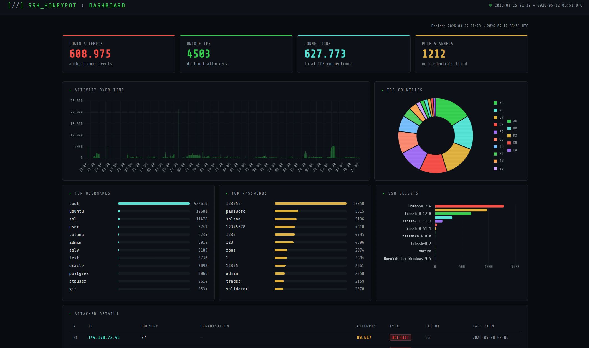
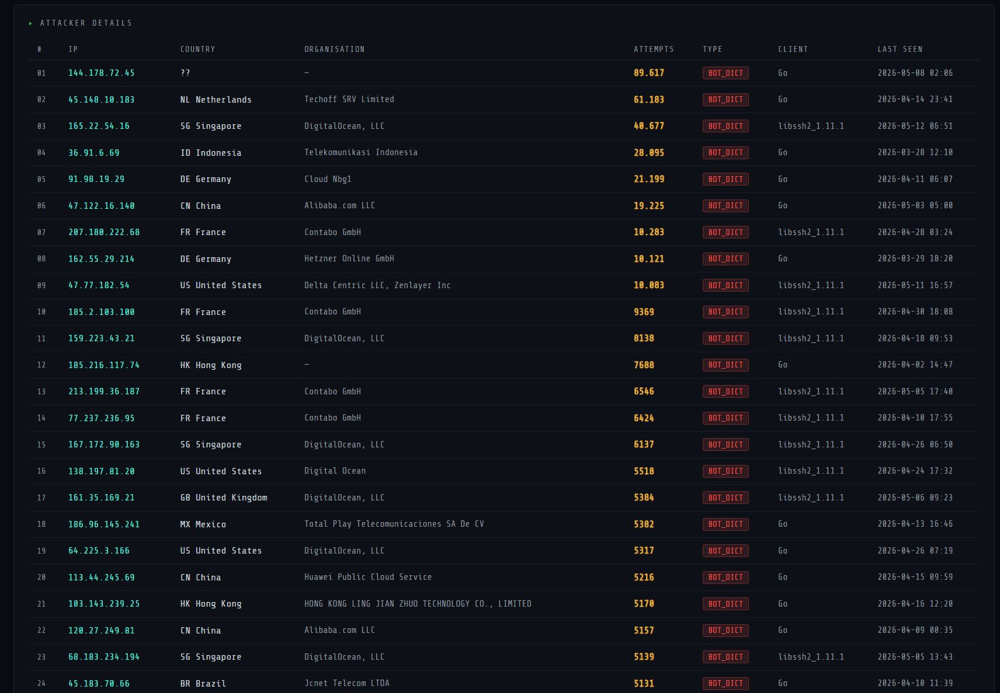

# SSH Honeypot

A fake SSH server that captures real-world brute-force attacks, stores them in a SQLite database, and visualises the data through a web dashboard.






## How it works

```
Internet (real attackers)
        │
        ▼ port 2222
┌───────────────────────┐
│  honeypot.py          │  Fake SSH server — always rejects login
│                       │  Logs every attempt to events.jsonl
└──────────┬────────────┘
           │
           ▼
┌───────────────────────┐
│  db.py                │  Imports events.jsonl → SQLite (honey.db)
└──────────┬────────────┘
           │
           ├──▶  geo.py        Geolocates each attacker IP
           └──▶  dashboard.py  Web dashboard (Flask + Chart.js)
```

## Results (47 days, 25 March – 12 May 2026)

| Metric | Value |
|---|---|
| Collection period | 2026-03-25 → 2026-05-12 |
| Login attempts | **609,869** |
| Total TCP connections | **628,734** |
| Unique IPs observed | **4,518** |
| Pure scanners (no credentials) | **1,218** |

### Top attackers

| IP | Country | Provider | Attempts |
|---|---|---|---|
| 144.178.72.45 | Netherlands | Eurofiber Nederland BV | 89,617 |
| 45.148.10.183 | Netherlands | Techoff SRV Limited | 61,183 |
| 165.22.54.16 | Singapore | DigitalOcean | 41,042 |
| 36.91.6.69 | Indonesia | Telekomunikasi Indonesia | 28,095 |
| 91.98.19.29 | Germany | Cloud Nbg1 | 21,199 |

A single IP from the Netherlands alone accounted for **~15% of all login attempts**.

### Top credentials attempted

**Usernames:** `root` (423,041 — 69% of all attempts), `ubuntu`, `sol`, `user`, `solana`

**Passwords:** `123456`, `password`, `solana`, `12345678`, `1234`

The presence of `sol` and `solana` as both username and password is notable — this is a botnet specifically targeting misconfigured [Solana](https://solana.com) cryptocurrency nodes, which use these as default credentials.

### Top countries

| Country | Unique IPs | Attempts |
|---|---|---|
| Netherlands | 39 | 157,781 |
| Singapore | 93 | 76,388 |
| China | 998 | 66,487 |
| Germany | 98 | 56,239 |
| United States | 666 | 49,495 |

China has the most unique IPs (998) but the Netherlands generates more total attempts — a smaller number of highly active bots vs a larger number of low-activity scanners.

### SSH clients

| Client | Unique IPs | Notes |
|---|---|---|
| `SSH-2.0-OpenSSH_7.4` | 1,283 | Standard OpenSSH — released 2017, still widely deployed |
| `SSH-2.0-libssh_0.11.1` | 974 | C library used in automated attack tools |
| `SSH-2.0-libssh_0.12.0` | 683 | Newer version of the same library |
| `SSH-2.0-Go` | 320 | Custom Go-based brute-force tools |
| `SSH-2.0-libssh2_1.11.1` | 140 | Another C SSH library, common in botnets |


## Attacker types

**SCANNER** — connects but never attempts a login. Just checking which ports are open. 1,218 IPs fall into this category.

**BOT_SIMPLE** — tries 1–3 common default passwords (`admin/admin`, `root/root`) then leaves.

**BOT_DICT** — tries hundreds of different credentials across multiple sessions. Responsible for the vast majority of attempts.

**TARGETED** — tries very specific credentials that reveal the real target. Examples observed:
- `AdminGPON` / `ALC#FGU` — default credentials for Alcatel GPON routers
- `sol` / `solana` — default credentials for Solana cryptocurrency nodes
- `pi` / `raspberry` — default credentials for Raspberry Pi

## Key observations

**Attacks arrive immediately.** The honeypot received its first connection within minutes of deployment — no advertisement, fresh IP.

**Most attackers use cloud infrastructure.** The top attacking countries and providers (DigitalOcean, Hetzner, Alibaba) are all legitimate cloud platforms. Attackers rent cheap VPS instances, run their campaigns, and abandon them — making IP blocking ineffective as a long-term defence.

**Changing default credentials is the single most impactful security measure.** The presence of device-specific credentials (`AdminGPON`, `solana`, `raspberry`) shows that attackers maintain updated databases of factory defaults for every internet-connected device. A device with changed credentials is effectively invisible to these campaigns.


## Technical stack

| Component | Technology |
|---|---|
| Honeypot | Python + Paramiko |
| Database | SQLite |
| Geolocation | ip-api.com (free, no API key needed) |
| Dashboard | Flask + Chart.js |
| Secure access | SSH tunnel (`ssh -L 5000:localhost:5000`) |

## Setup

**Install dependencies:**
```bash
pip3 install paramiko flask requests
```

**Run the honeypot** (inside tmux so it keeps running after you disconnect):
```bash
tmux new -s honeypot
python3 honeypot.py
# Detach: Ctrl+B then D
# Reattach: tmux attach -t honeypot
```

**Import and enrich data:**
```bash
python3 db.py       # import new events into the database
python3 geo.py      # geolocate new IPs (skips already-known ones)
```

**View the dashboard:**
```bash
# On your local machine — open a tunnel
ssh -L 5000:localhost:5000 user@<SERVER_IP>

# On the server
python3 dashboard.py

# Open in browser
http://localhost:5000
```

**Automate updates with cron:**
```bash
crontab -e
# Add:
*/30 * * * * cd /home/user && python3 db.py  >> /dev/null 2>&1
0    * * * * cd /home/user && python3 geo.py >> /dev/null 2>&1
```

## Project structure

```
ssh-honeypot/
├── honeypot.py     # fake SSH server
├── db.py           # log importer
├── geo.py          # IP geolocation
├── dashboard.py    # web dashboard
└── README.md
```

> `events.jsonl`, `honey.db`, and `host_key_rsa` are excluded from the repository — they contain collected IP addresses, credentials, and a private key.

## Findings

Implementing SSH at the transport layer with Paramiko made the protocol's security model concrete — the real weaknesses are credential reuse and misconfiguration, not the cryptography itself.

The data confirms that the internet is hostile by default: a fresh, unadvertised IP receives automated attack traffic within minutes. After 47 days, 609,000 login attempts from 4,500 distinct sources. At this volume, even a low success rate represents a large number of compromised machines.
